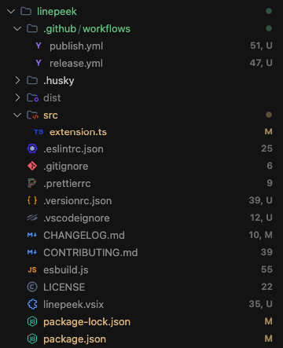

# LinePeek

[](https://marketplace.visualstudio.com/items?itemName=brunobrise.linepeek)
[](https://code.visualstudio.com/)
[](https://opensource.org/licenses/MIT)
[](https://conventionalcommits.org)

> Display line counts directly in the VS Code Explorer

LinePeek is a lightweight Visual Studio Code extension that shows the number of lines in each file as a badge in the Explorer sidebar, helping you quickly identify file sizes and navigate large codebases with ease.



---

## Table of Contents

- [Features](#features)
- [Installation](#installation)
- [Usage](#usage)
- [Configuration](#configuration)
- [How It Works](#how-it-works)
- [Contributing](#contributing)
- [Changelog](#changelog)
- [License](#license)
- [Acknowledgments](#acknowledgments)

---

## Features

- ⚡ **High Performance** – Stream-based file reading and intelligent caching ensure minimal impact on VS Code's performance, even in large workspaces.
- 🎯 **Unobtrusive Design** – Line counts appear as subtle badges that don't clutter the Explorer view.
- ⚙️ **Configurable** – Customize file types to ignore, set colors for thresholds, and toggle compact notation.
- 📊 **Rich Metrics** – Optionally show SLOC (Source Lines of Code) and Git changes in tooltips.
- 🔄 **Real-time Updates** – Line counts automatically refresh as you type (debounced).
- 📁 **Directory Totals** – Cumulative line counts for directories to see folder weight at a glance.
- 💠 **Compact Notation** – Smart formatting to fit line counts within narrow badge space (e.g., `123` -> `1H`, `1234` -> `1k`).
- 🛠️ **Workspace Stats** – Command to calculate detailed line counts across your entire project.

---

## Installation

### From the VS Code Marketplace

1. Open VS Code
2. Go to Extensions (`Cmd+Shift+X` / `Ctrl+Shift+X`)
3. Search for "LinePeek"
4. Click **Install**

### From the Command Line

```bash
code --install-extension brunobrise.linepeek
```

### From Open VSX Registry

For VS Code-compatible editors (VSCodium, etc.):

```bash
wget https://open-vsx.org/api/brunobrise/linepeek/0.1.5/file/brunobrise.linepeek-0.1.5.vsix
```

---

## Usage

LinePeek works automatically once installed. Line counts appear as badges next to files.

### Commands

- **LinePeek: Show Workspace Statistics** – Generate a detailed report of total lines, files, and language distribution.
- **LinePeek: Toggle Display Mode** – Cycle between showing line counts, file sizes, or both in the badge.

### Tooltips

Hover over a file badge to see:

- Total number of lines
- File size
- SLOC (if enabled)
- Git added/removed lines (if enabled)

---

## Configuration

Access settings with `Cmd+,` (macOS) or `Ctrl+,` (Windows/Linux) and search for "LinePeek".

### Settings

| Setting                        | Type       | Default                                     | Description                                                          |
| ------------------------------ | ---------- | ------------------------------------------- | -------------------------------------------------------------------- |
| `linepeek.enable`              | `boolean`  | `true`                                      | Enable or disable line count decorations globally.                   |
| `linepeek.displayMode`         | `string`   | `"lines"`                                   | Show "lines", "size", or "both" in badges.                           |
| `linepeek.useCompactNumbers`   | `boolean`  | `true`                                      | Use compact notation (e.g., `1H`, `1k`) to fit in badges.            |
| `linepeek.showSloc`            | `boolean`  | `false`                                     | Show Source Lines of Code (excluding comments/blank) in tooltip.     |
| `linepeek.showDirectoryTotals` | `boolean`  | `false`                                     | Show total lines for directories.                                    |
| `linepeek.showGitChanges`      | `boolean`  | `false`                                     | Show Git added/removed lines in tooltip.                             |
| `linepeek.ignoredPatterns`     | `string[]` | `["**/node_modules/**", "**/.git/**", ...]` | Glob patterns for ignored files/folders.                             |
| `linepeek.colorThresholds`     | `object`   | `{ small: 100, medium: 500, large: 1000 }`  | Set thresholds for color-coding files (info, warning, error colors). |

### Custom Thresholds Example

```json
{
  "linepeek.colorThresholds": {
    "small": 50,
    "medium": 200,
    "large": 500
  }
}
```

---

## How It Works

1. **Lazy Loading** – Line counts are calculated only when files become visible in the Explorer.
2. **Stream-Based Reading** – Uses Node.js streams to count newlines efficiently.
3. **Optimized Badges** – Special formatting (`1H` for hundreds, `1k` for thousands) ensures text is always legible and fits within the 2-character limit of VS Code badges.
4. **Caching** – Intelligent caching keeps the interface fast.

---

## Contributing

We welcome contributions! Please read our [Contributing Guide](CONTRIBUTING.md).

```bash
# Clone the repository
git clone https://github.com/brunobrise/linepeek.git
cd linepeek

# Install dependencies
npm install

# Start development mode
npm run watch
```

Press `F5` in VS Code to launch the extension in a new Extension Development Host window.

---

## Changelog

See [CHANGELOG.md](CHANGELOG.md) for full history.

### Latest Release (0.1.5)

- ✨ **Compact badges**: Optimized formatting to fit line counts in small badges.
- 📁 **Directory totals**: Optional line count aggregation for folders.
- 📈 **SLOC metrics**: Added comment-aware line counting.
- 🛠️ **Glob improvements**: Robust pattern matching for ignored files.
- ⚡ **Performance stats**: Added status bar indicator for cache health.

---

## License

MIT License - see [LICENSE](LICENSE) for details.

---

## Acknowledgments

- Built with [VS Code Extension API](https://code.visualstudio.com/api)
- Uses [esbuild](https://esbuild.github.io/) for bundling

---

<p align="center">Made with ❤️ by <a href="https://github.com/brunobrise">Bruno Brise</a></p>
